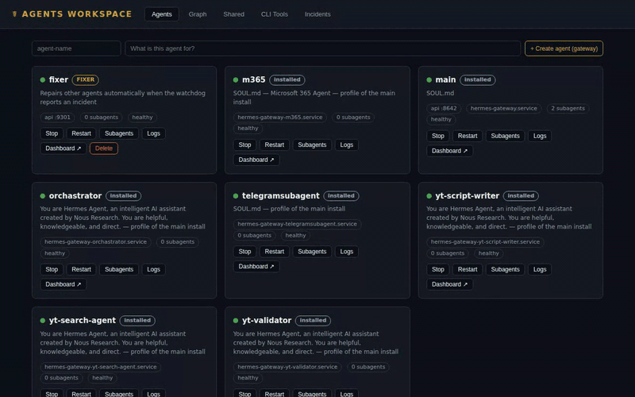

# Hermes Orchestrator

[](https://github.com/EssadikElmangoug/hermes-orchestrator/actions/workflows/ci.yml)
[](LICENSE)

Run a **fleet of [Hermes Agents](https://github.com/NousResearch/Hermes-Agent)** from one place — and let them work as a team:

- **Shared everything** — a skill, plugin, CLI tool, MCP server, or login added by *any* agent (or by you) is instantly usable by *every* agent. Running agents reload automatically.
- **Self-healing** — crashes and failing health checks are dispatched to a dedicated *fixer* agent that investigates and repairs the others.
- **Adopts your existing install, read-only** — if the machine already runs Hermes, the workspace manages it alongside the fleet but **never writes into it**. A watchdog even restores its systemd units if anything clobbers them.



## Install

One command — it installs Hermes Agent if needed, sets everything up, and starts the workspace:

```bash
curl -fsSL https://raw.githubusercontent.com/EssadikElmangoug/hermes-orchestrator/main/install.sh | bash
```

Then open **http://127.0.0.1:9100**. If this is a fresh machine, run `hermes` once to sign in to an AI provider — every agent you create will inherit that login automatically.

Re-run the same command any time to update.

## What you get

| | |
|---|---|
| **Fleet UI** | Create, start, stop, and delete agents from a web dashboard. Each agent gets its own home, ports, and native Hermes dashboard. |
| **Visual workflows** | An n8n-style canvas: chain agent steps into automations, attach skills/CLI tools/MCP servers to each step, gate on human approval, and deliver results to a linked channel (Telegram, WhatsApp…). Triggered manually, on a cron schedule, or by webhook. A built-in *workflow-builder* agent constructs workflows from plain-language chat — you watch them appear on the canvas. |
| **Shared everything** | Provider logins, API keys, model/MCP config, skills, plugins, memories, CLI tools, and webhook routes are shared across the whole fleet. When any agent (or you) adds a skill, plugin, or tool, every other agent gets it automatically — running agents are reloaded so they actually see it. |
| **Adopts existing installs** | Already run Hermes on the machine? The workspace discovers it and manages it **read-only** — it appears in the fleet, and its skills, logins, and tools seed the shared layer, but the workspace never writes into it. |
| **Watchdog + self-repair** | Crashed gateways restart automatically. Incidents (crashes, log errors, failed health checks) are dispatched to a dedicated *fixer* agent that investigates and repairs. |
| **Safe by design** | Workspace agents run with `HOME` confined to their own directory, so nothing they do can touch the machine's real Hermes install. A guard also restores adopted systemd units if anything clobbers them. |

## How sharing works

`workspace/shared/` is the single source of truth. Workspace-created agents **symlink** to it (changes are instant); adopted installs are **copied from** (never written to), continuously:

| Resource | Where | Notes |
|---|---|---|
| Provider logins | `auth.json` | one sign-in covers the fleet |
| API keys | `.env` shared block | merged key-by-key, last writer wins |
| Model + MCP servers | `config.yaml` | merged per-entry — two agents adding different MCPs both land |
| Skills | `skills/` | nested categories fully supported |
| Plugins | `plugins/` | gateways reload automatically on changes |
| CLI tools | `bin/` + `clis/` | executables on every agent's PATH, manifests shown in the UI |
| Memories | `memories/` | fleet-wide long-term memory |
| Webhooks | `webhook_subscriptions.json` | merged per-route |

Channel identity (Telegram, WhatsApp, dashboard ports…) always stays **per-agent** and is never shared.

## Workflows

The **Workflows** tab is a drag-and-drop canvas for chaining the fleet into
automations — e.g. *manual/cron/webhook trigger → researcher agent (with a
research skill attached) → writer agent → human approval → deliver to
Telegram*. Steps run through each agent's OpenAI-compatible API server
(enable with `API_SERVER_ENABLED=1` + `API_SERVER_PORT`/`KEY` in the agent's
`.env` — workspace-created agents have it on by default), each step receiving
the labeled outputs of its upstream steps. Every step can also pick its own
**model** (`provider/model` from the fleet's model catalog — e.g. a cheap
model for research, a top model for writing): the workspace auto-writes
matching `model_routes` into workspace agents' API servers at start, and runs
fail fast if a step requests a model its agent doesn't route. Runs show live on the canvas with
per-node output, history, and resume-worthy approval gates; failures raise
incidents that the fixer picks up like any other fleet problem.

Don't want to build it by hand? Open the ✨ **AI Build** chat: a default
`workflow-builder` agent (provisioned like the fixer) designs and edits the
workflow document for you while the canvas live-renders every change.

## Serving it on a domain (optional)

By default everything is local (`127.0.0.1`). To put the workspace and every agent dashboard behind your own domain with a single login:

1. Point `your-domain.com` and `dash.your-domain.com` at the machine, and reverse-proxy both to `127.0.0.1:9100`. With Caddy:

   ```
   your-domain.com      { reverse_proxy 127.0.0.1:9100 }
   dash.your-domain.com { reverse_proxy 127.0.0.1:9100 }
   ```

2. Set two environment variables on the service (`systemctl --user edit hermes-orchestrator`):

   ```
   Environment="WORKSPACE_DOMAIN=your-domain.com"
   Environment="WORKSPACE_PASSWORD=choose-a-password"
   ```

That's it — agent dashboards are served at `https://dash.your-domain.com/a/<agent>`, and one login at `/login` covers the workspace and every dashboard. Creating new agents never requires touching DNS, certificates, or the web server again. (Scripts can authenticate with `Authorization: Bearer <password>` or HTTP Basic. `WORKSPACE_PASSWORD_FILE=/path` is supported instead of the inline password.)

The agent dashboards' **Files** tab is disabled when served through the proxy, so the filesystem is never exposed to the web.

## Manual install

If you'd rather not pipe to bash:

```bash
git clone https://github.com/EssadikElmangoug/hermes-orchestrator
cd hermes-orchestrator
python3 -m venv .venv
.venv/bin/pip install fastapi uvicorn pydantic pyyaml httpx websockets
.venv/bin/python workspace/server.py       # UI on http://127.0.0.1:9100
```

Requires `git`, Python 3.10+, and [Hermes Agent](https://hermes-agent.nousresearch.com) on the PATH.

## Safety guarantees for existing installs

- Adopted agents are **never** written to — not their home, config, `.env`, memory, or profiles — and cannot be deleted from the workspace.
- Their reusable resources (logins, skills, plugins, tools, webhooks) are **copied** into the shared layer, never moved.
- A watchdog snapshots adopted systemd unit files and restores them if any process rewrites them to point at the wrong home.

## Learn more

- [Architecture](docs/architecture.md) — how the sync, watchdog, fixer, and dashboard proxy fit together
- [Security](SECURITY.md) — network exposure, auth, secrets handling, blast-radius containment
- [Contributing](CONTRIBUTING.md) — code map and the rules that matter
