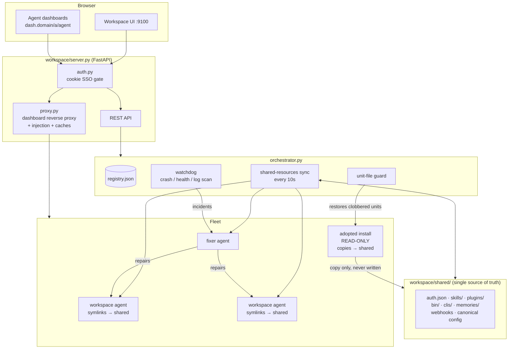

# Architecture

Hermes Orchestrator is a control plane for a fleet of [Hermes
Agents](https://github.com/NousResearch/Hermes-Agent). It is deliberately
small: one FastAPI server, one orchestration module, one reverse proxy, and a
vanilla-JS UI — no database, no message queue, no framework. State lives in
plain JSON files and the filesystem.

## The pieces

### Registry and agent lifecycle (`orchestrator.py`)

`registry.json` is the fleet's source of truth: each agent's home directory,
ports, API key, and flags. Two kinds of agents exist:

- **Workspace-created** — homes under `agents/<name>/.hermes`, spawned as
  child processes with `HOME` confined to the agent's directory (this is what
  keeps Hermes's user-scope self-management from ever touching the machine's
  real install).
- **Adopted** — pre-existing Hermes installs discovered from their systemd
  units. Flagged `read_only`; start/stop routes through `systemctl`, and the
  workspace never writes into their homes.

### The shared layer (`workspace/shared/`)

Every reusable resource lives here exactly once:

- Workspace agents **symlink** `skills`, `plugins`, `bin`, `clis`,
  `memories`, `auth.json`, and `webhook_subscriptions.json` straight into the
  shared layer — writes land there instantly, no copying.
- Adopted installs are **seeded from** by recursive copy-if-missing
  (existing shared entries always win, and nested items — e.g. a new skill
  inside an existing category — propagate at any depth).
- Config (`model`, `mcp_servers`, …) and `.env` keys are merged
  **per entry**, multi-master: any agent may edit, edits merge by key with
  last-writer-wins on conflicts, and the canonical result is written back to
  every workspace agent (per-agent sections like channel credentials are
  preserved).

The sync runs every ~10 seconds. When shared skills or plugin code change,
running gateways are gracefully reloaded — Hermes caches its skill index
in-process, so without this, agents would not see each other's new skills.

### Watchdog, incidents, and the fixer

Each tick, the watchdog restarts crashed managed gateways, scans logs for
errors, probes agent API health, and re-checks adopted units' systemd files
(restoring them from snapshots if some process rewrote them to point at the
wrong home). Every incident is recorded and dispatched to the **fixer** — a
normal workspace agent with a maintenance soul — which investigates and
repairs the affected agent.

### Dashboard proxy (`proxy.py`)

Agent dashboards are native Hermes web dashboards, served through the
workspace on one fixed hostname (`dash.<domain>/a/<name>` pins the selection
in a cookie). The proxy:

- rewrites `Host`/`Origin` so the dashboards' DNS-rebinding guard keeps
  working, and blocks the Files API entirely;
- injects `static/dash_inject.js` into every dashboard page — the CLI-tools
  panel, a provider-health banner, and an "All models" picker tab — so the
  installed Hermes package is **never patched**;
- caches `/api/model/options` per agent with stale-while-revalidate semantics
  (building that list cold does serial provider API calls; the cache makes
  the picker open instantly and re-warms on every model switch).

### Self-documentation (`seed_skills/`)

Agents can only use the sharing feature if they know it exists. The repo
bundles a `shared-resources` skill that the sync seeds into the shared layer
(repo is its source of truth), injects a workspace section into the shared
`hermes-agent` skill, and stamps a managed context block into every workspace
agent's `SOUL.md` — so every agent, present and future, understands where to
save things so the whole fleet benefits.
